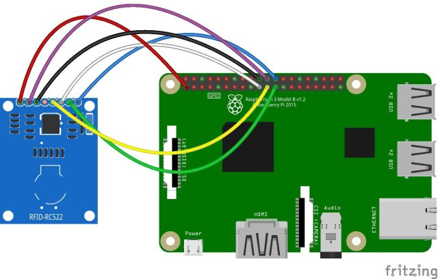

# RFID_client

La Raspberry pi Zero avec le module RC522 envoie les UIR des cartes RFID scannées à une base de donnée MySQL distante via wifi. 

## Branchement de la Raspberry Pi Zero


```
Branchez le module RFID aux broches du Raspberry Pi comme ci-dessous.

+-------------+------------------+
| RFID RC522  | Raspberry Pi     |
+-------------+------------------+
| VCC         | PIN 1 (3V)       |
| RST         | PIN 22           |
| GND         | PIN 6            |
| MISO        | PIN 21           |
| MOSI        | PIN 19           |
| SCK         | PIN 23           |
| NSS         | PIN 24           |
| IRC         | __               |
+-------------+------------------+

```





## Activer le bus SPI

vérifier que SPI est actif

`lsmod | grep spi`

Si le bus SPI n'a pas été activé :
`sudo raspi-config`
`sudo reboot`

## Installation logiciel

### Installer mysqlclient pour python avec pip

`pip install mysqlclient`


### Installer SPI-PY ou SIGNAL pour python


```
cd ~
git clone https://github.com/lthiery/SPI-Py.git
cd ~/SPI-Py
git checkout 8cce26b9ee6e69eb041e9d5665944b88688fca68
sudo python setup.py install
```

### Installer MFRC522-python

```
cd ~
git clone https://github.com/EspaceRaspberryFrancais/RFID-RC522.git

cd ~/RFID-RC522
sudo python Lecture.py

cd ~/RFID-RC522
sudo python Ecriture.py
```

Il faut que la base de donnée SQL puisse recevoir des connexions exterieures :
Tuto à écrire.

## Améliorations à apporter

- Témoins lumineux et sonore du passage de la carte.
- Écran LCD affichant le nom du propriétaire de la carte.
- Lancer le script automatiquement au branchement de la carte.

## Tutos similaires

`https://www.deviceplus.com/connect/integrate-rfid-module-raspberry-pi/`

`http://espace-raspberry-francais.fr/Composants/Module-RFID-RC522-Raspberry-Francais/`

`https://www.teachmemicro.com/rfid-login-raspberry-pi/`